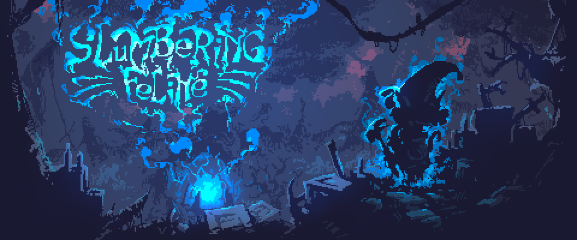
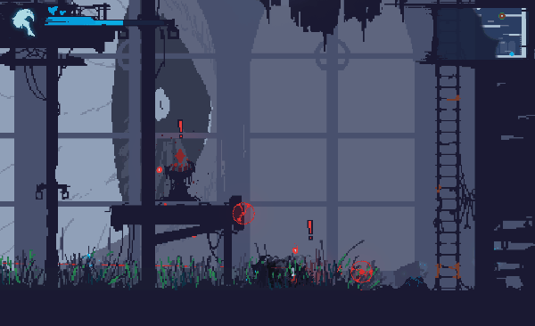
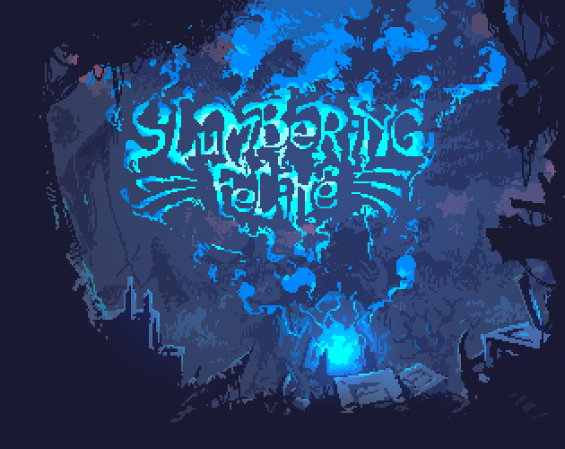
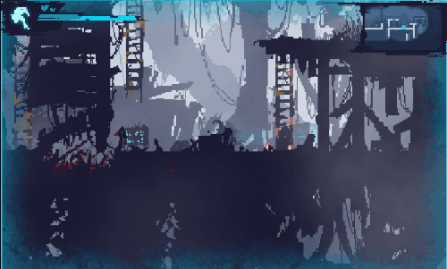
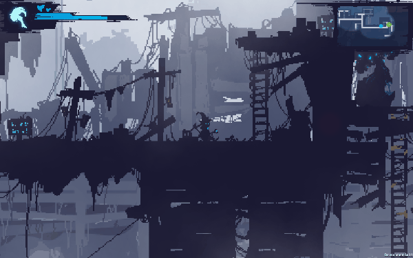
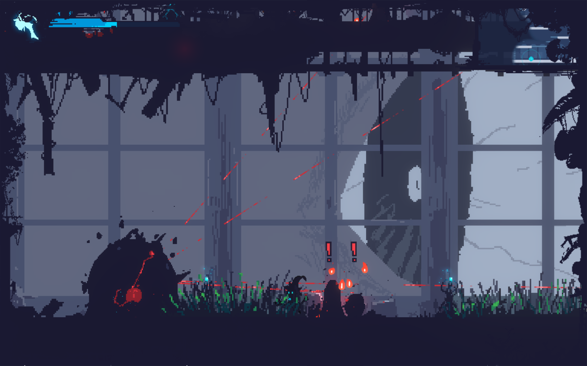
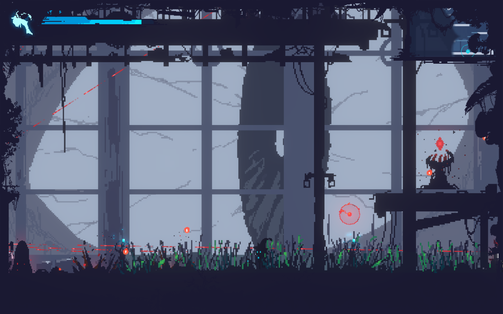
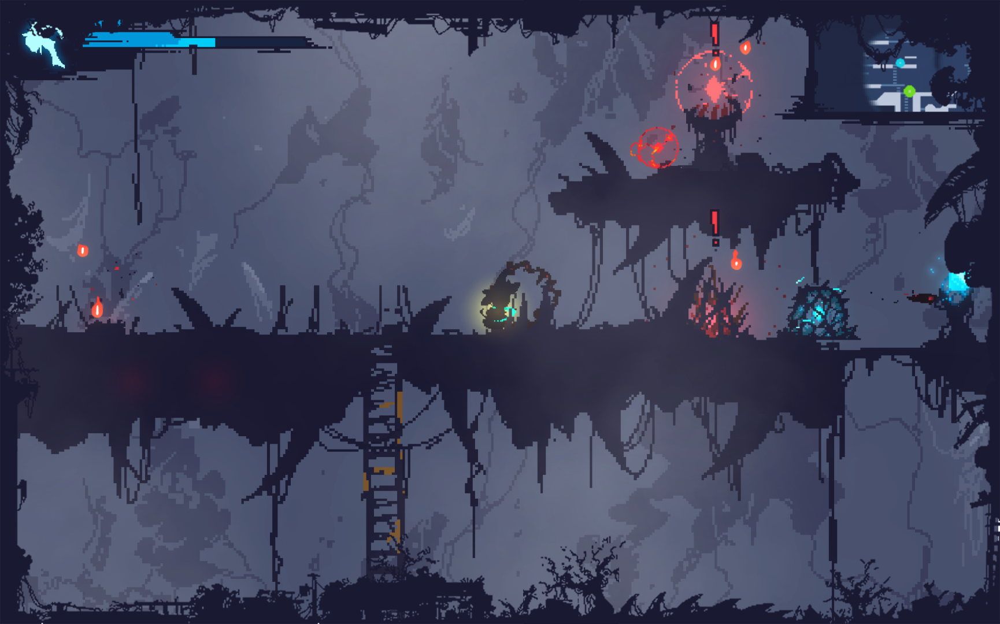
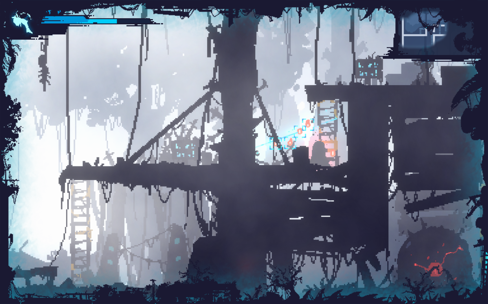
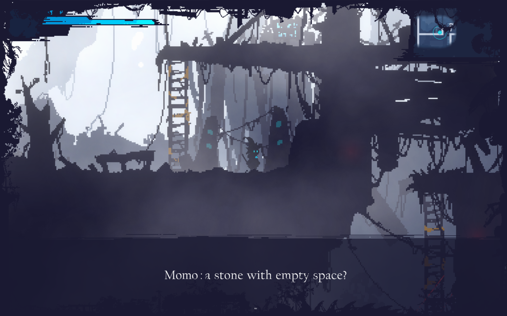

# Momo Press Kit

## Press info

We are happy that you are interested in featuring the game on your site. This page should help give you some details, information, and assets, that help you make the best content possible. Let us know if there is anything we can help you with.

You are welcome to use any of the assets that you can find on our website. We would recommend checking out our artwork and screenshot sections.

## Press Kit

We have prepared a single archive for download containing all you may use for press purposes. [You can download the Press Kit here](https://github.com/theflavare/slumbering-feline-press-kit/releases/tag/latest).

## Gameplay & Trailer

- Preview: https://www.youtube.com/watch?v=mMi40pAauBQ
  
  

## General Overview

Slumbering Feline is a single-player, one-shot game featuring a feline-themed story. Step into the shoes of Momo, who finds herself lost in a strange dream and trying to escape from her slumber.

Slumbering Feline is currently available on Windows via Itch.io and coming soon to Steam.

### Story

Waking up in an unfamiliar world, Momo is equipped with the mystical gear she’s always desired.

Momo will explore, battle enemies, discover weak points, find the key, and make a daring escape. Can Momo find her way out of this dreamscape?

### Features

- **2D side-scrolling platformer** with pixel-art and an atmospheric environment.
- Unique combat system featuring **Shutter Attacks and Parry Actions**.
- **10-25** minutes playtime.
- **A single objective** within a large, interconnected level.
- **7 enemy types, 2 weapons, plus a parry mechanic**.
- **4 checkpoints** for respawn and progression.
- **Xbox controller** support (Windows).
- Available on **Windows**.

## Factsheet

- Game Title: Slumbering Feline
- Developer / Creator / Copyright: The Flavare
- Platforms: Windows
- Genre: 2D Platformer, Adventure, One-shot Game
- Release Date: 27 September 2024 (Itch.io), TBA (Steam)
- Store (Itch.io): https://theflavare.itch.io/slumbering-feline

### Other Facts

- Perspective: 2D
- Art Style: 2D Pixel-art
- Game Engine: Unity Engine
- Related / Inspiration games: Fatal Frame, Dead Cell
- Language: English
- Price: Free
- Created At: 2024-09-27
- Updated At: 2024-10-01

## Contact

For all press enquiries you can contact us at via Email.

- Email: hello@theflavare.com

## The Creator

> Hi! This is Raditz, one of the creators behind Slumbering Feline. My team and I are thrilled to announce this new game, blending a short story collection with unique gameplay elements.

> In Slumbering Feline, we've introduced a scan or shutter-style combat system, where you attack enemies in a distinctive, non-traditional way. Although this is a one-shot story, we hope to continue building on its world in future installments.

> We’re excited to share this experience with you and bring together everything we've learned over the years. We hope you enjoy playing Slumbering Feline as much as we enjoyed creating it!

You can find out about us in https://theflavare.com/about

## Assets / Resources

- Website: https://theflavare.com
- X / Twitter: https://x.com/TheFlavare
- IG: https://instagram.com/theflavare

You can use all resources relate to game for publication

- [Logo](https://github.com/theflavare/slumbering-feline-press-kit/tree/main/logo): https://github.com/theflavare/slumbering-feline-press-kit/tree/main/logo
- [Screenshot](https://github.com/theflavare/slumbering-feline-press-kit/tree/main/screenshot): https://github.com/theflavare/slumbering-feline-press-kit/tree/main/screenshot
- [Artwork](https://github.com/theflavare/slumbering-feline-press-kit/tree/main/artwork): https://github.com/theflavare/slumbering-feline-press-kit/tree/main/artwork

### Artworks

### Screenshot

